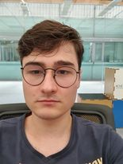

# Vincent Devilers

## me in one sentence
Je suis toujours partant pour aller prendre un verre.  

|  Informations       |       |
|---------------------|-------|
| Gender              | Male  |
| Favorite color      | Green |
| Favorite food       | Pizza |
| Pinneapple on pizza |   No  |
| Birthday            | 27/01 |

## Hobbies
* Sports:
    * Football
    * cycling
* read a book

## You can always count on me when
Pour faire découvrir la ville après le travail.

## A funny story
Quand j'avais 10ans, j'étais parti en Autriche pour un trounois de football. L'hotel, dans lequel on logeait, avait des lits superposés. Après m'être battu avec mes coéquipiers j'ai réussi à prendre une des places hautes d'un des lits. Malheureusement, pendant la première nuit, j'ai perdu ce privilège.  
Mais comment une telle chose a pu se produire ?  
Il faut savoir que j'avais le sommeil agité, j'avais tendance à parler et surtout à bouger. C'est ainsi que pendant cette nuit je suis tombé de mon lit, mais parce qu'il y a un mais: **JE NE ME SUIS PAS RÉVEILLÉ**, par contre, j'ai réveillé tout le monde en tombant.  
### TL;DR
Tout ça pour dire que je suis tombé d'un lit superposé et que je ne me suis pas réveillé.  

  

<< [PREVIOUS](https://github.com/AnthxnyD/challenge-markdown/tree/DEV) || Vincent Devilers || [NEXT](https://github.com/Roulian1/challenge-markdown/blob/main/README.md) >>
